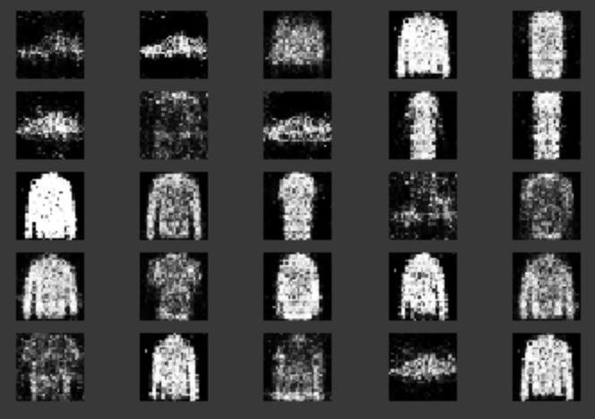
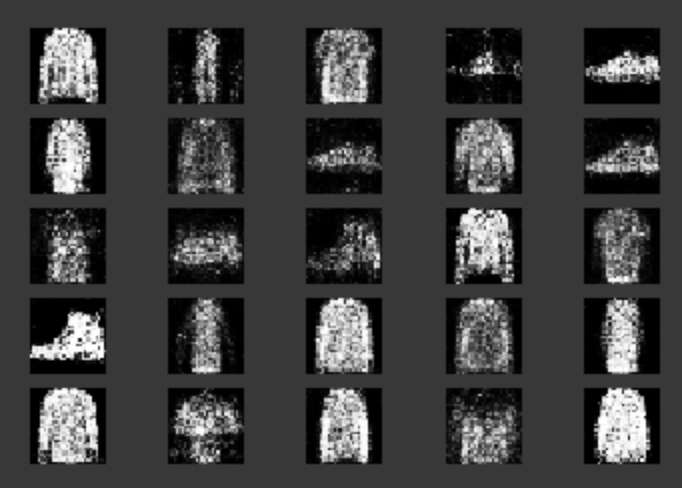

# Generate_fashin_with_GANS
We use a GAN to generate new fashion items based on the MNIST data set.

For the architecture of the GAN I follow advise presented in this [repo](https://github.com/soumith/ganhacks).

## Some example outputs from the trained generator model:

